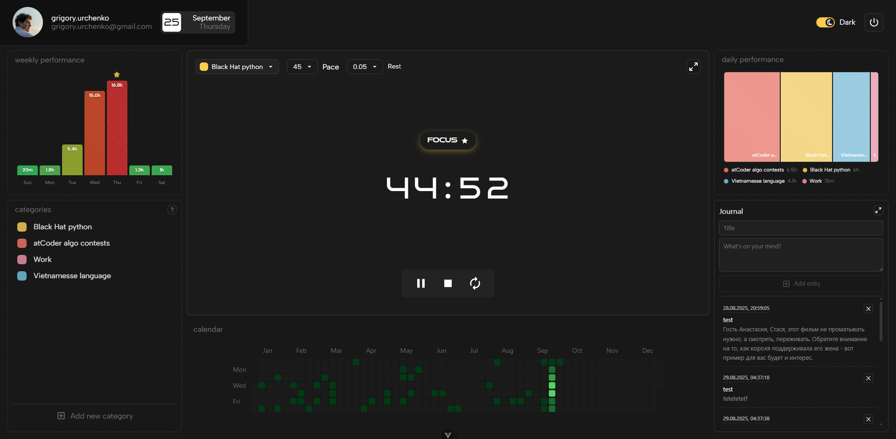

# FocusTrack: Personal Productivity Tracker

FocusTrack is a single-page application (SPA) that helps users manage their time effectively using a Pomodoro-like approach.  
It provides in-depth focus session tracking with weekly, daily, and yearly statistics — all visualized in interactive charts and a GitHub-like calendar heatmap.

## Features

- **Authentication**

  - Login and registration with **JWT-based password authentication**
  - OAuth via **Google** (GitHub integration planned)

- **Main Dashboard** (split into 6 blocks):

  1. **Weekly Performance** – chart of focus activity during the current week (e.g., reading, coding, etc.)
  2. **Categories** – customizable focus categories (create, edit, delete)
  3. **Focus Timer** – central block with countdown for **focus** and **rest** phases, linked to selected category
  4. **Yearly Heatmap** – GitHub-like calendar showing focus activity across the year
  5. **Daily Performance** – stacked chart for today’s activity, showing how much time was spent on each category
  6. **User Journal** – personal diary for writing notes, reflections, and progress logs

- **Statistics**

  - Weekly, daily, and yearly insights into productivity
  - Category-based time distribution

- **Future Features**
  - OAuth with **GitHub**
  - Secure online chat (possibly with Web3 integration)

### Dashboard



## Tech Stack

- **Backend**: FastAPI (Python), PostgreSQL, SQLAlchemy ORM, Alembic (migrations)
- **Frontend**: Vue 3 (Vite), Pinia (state management), Axios
- **Authentication**: JWT + OAuth2 (Google, GitHub planned)
- **Task Queue**: RabbitMQ + Custom workers for background tasks
- **Deployment**: Docker, Nginx, CI/CD pipeline

## Usage

- Start and track focus sessions.
- View your productivity heatmap.
- Analyze detailed statistics of past sessions.

## Application Overview

FocusTrack is a **Single Page Application (SPA)** with secure authentication (email/password and Google OAuth, GitHub coming soon).

The main dashboard is divided into **six blocks**:

1. **Weekly Performance** – a chart showing how much time was spent on various activities (e.g., reading, coding) during the current week.
2. **Categories** – manage your focus categories (create, update, edit, delete).
3. **Timer** – the central block where you set focus and rest durations and select the category of focus.
4. **Yearly Heatmap** – a GitHub-like calendar showing how consistently you focused throughout the year.
5. **Daily Performance** – a graph showing today’s focus activity broken down by categories.
6. **User Journal** – a personal diary where you can write notes about your day or focus sessions.

## API Documentation

API documentation is available at [http://localhost:8000/docs](http://localhost:8000/docs) (Swagger UI).

## Deployment

To deploy using Docker:

```bash
docker-compose up --build -d
```

## Installation

### Prerequisites

- Python 3.9+
- Node.js 16+
- PostgreSQL
- RabbitMQ
- Docker

### Backend Setup

```bash
git clone https://github.com/yourusername/focustrack.git
cd focustrack/backend

python -m venv venv
source venv/bin/activate  # On Windows: venv\Scripts\activate

pip install -r requirements.txt
alembic upgrade head

uvicorn app.main:app --reload
```

### Frontend Setup

```bash
cd frontend

npm install

npm run dev
```

## Contribution

Feel free to submit issues and pull requests to improve FocusTrack!

## License

This project is licensed under the **MIT License**.

---

### Contact

For any inquiries or if you want to give me money, reach out to `grigory.urchenko@gmail.com`.
